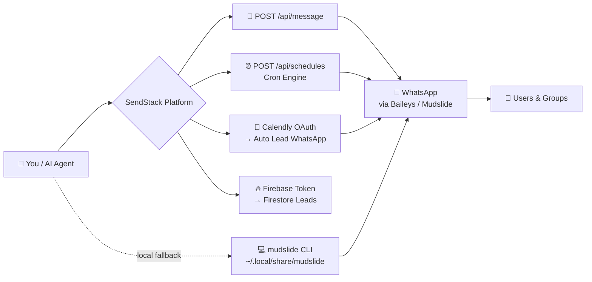

<p align="center">
  
  
  
</p>

<h1 align="center">📱 SendStack × Mudslide</h1>
<h3 align="center">The Complete WhatsApp Automation Platform for AI Agents</h3>

<p align="center">
  <b>One skill. Any AI agent. Full WhatsApp superpowers.</b><br/>
  Send messages, schedule campaigns, capture Calendly leads & automate groups — via REST API or local CLI.
</p>

<p align="center">
  <a href="https://github.com/yashas-13/mudslide-whatsapp-automation"></a>
  
  
  
  
</p>

<p align="center">
  <a href="#-what-is-this">What is this?</a> •
  <a href="#-see-it-in-action">Demo</a> •
  <a href="#-architecture">Architecture</a> •
  <a href="#-features">Features</a> •
  <a href="#-quick-start">Quick Start</a> •
  <a href="#-api-reference">API</a> •
  <a href="#-ai-agent-prompt">AI Prompt</a>
</p>

---

## 🎬 What is This?

> **Imagine telling your AI: *"Send a WhatsApp reminder to my team every morning at 9 AM and message every Calendly booking automatically."* — and it just works.**

This repo is a **universal skill** that gives **any AI coding agent** (Pi, Claude Code, Cursor, Windsurf, Roo Code, Aider, Codex) the power to control WhatsApp:

| You Say | AI Does |
|---|---|
| *"Send 'Hello' to 91953..."* | `POST /api/message` — instant delivery |
| *"Schedule daily standup reminders"* | `POST /api/schedules` — cron, no server needed |
| *"Connect my Calendly"* | `GET /api/calendly/authorize` → auto WhatsApp on every booking |
| *"Broadcast to my top groups"* | `mudslide send` / `batch-send.sh` — rate-limited, safe |
| *"Build me a WhatsApp bot"* | Baileys `ai-bridge-example.mjs` — zero re-login |

**Why YouTube viewers love it:** No Selenium, no browser, no 500MB RAM waste. Pure WebSocket + REST. Works on your phone, laptop, or VPS.

---

## 👀 See It In Action

```
┌─────────────────────────────────────────────────────┐
│  YOU (chat with AI)                                 │
│  "Schedule a good morning message for my family      │
│   group every day at 7 AM IST"                      │
│                                                     │
│  AI AGENT                                           │
│  ✓ Created schedule "Good Morning"                  │
│  ✓ Recipients: Family (120363...@g.us)              │
│  ✓ Cron: 0 30 1 * * * (auto-converted from IST)    │
│  ✓ Fires daily — no server to keep alive            │
│                                                     │
│  NEXT DAY 7:00 AM IST → WhatsApp delivers 📨        │
└─────────────────────────────────────────────────────┘
```

> 📹 **For your Short:** Screen-record `curl /api/message` → WhatsApp notification pop. Then show `curl /api/schedules` → phone buzzes next morning. Instant wow.

---

## 🏗 Architecture



**Two ways to send, one session:**
- **Cloud REST API** — `https://<domain>/api/*` with `x-api-key`
- **Local CLI / Baileys** — `mudslide send` + Node.js scripts reusing `~/.local/share/mudslide` (no re-login!)

---

## ✨ Features

### 🔐 1. User & WhatsApp Lifecycle
Magic-link auth, 1-hour API keys, QR login, live connection checks, and IP introspection.

| Method | Path | What It Does |
|---|---|---|
| `POST` | `/api/register` | 📧 Send magic link to email (`?next=/custom-redirect`) |
| `GET` | `/api/verify/:token` | ✅ Verify token — `sha256(email)[0:10]` prefix check |
| `POST` | `/api/apikey/generate` | 🔑 Mint 1-hour `x-api-key` |
| `GET` | `/api/apikey/status` | ⏳ Is my key still alive? |
| `GET` | `/api/whatsapp/status` | 💚 Cheap local file check — safe to poll every second |
| `GET` | `/api/whatsapp` | 🌐 Real WhatsApp round-trip — use sparingly |
| `GET` | `/api/whatsapp/ip` | 🌍 Which residential IP is proxying me? |
| `GET` | `/api/whatsapp/qr` | 📷 Get QR to scan |
| `POST` | `/api/whatsapp/notify-user-connected` | 📲 Confirm scan done |
| `POST` | `/api/whatsapp/logout` | 🚪 Clean session after unlink |

### 💬 2. Instant Messaging & Groups

```bash
# → One person
curl -X POST https://<domain>/api/message \
  -H "x-api-key: $KEY" -H "Content-Type: application/json" \
  -d '{"to":"919538384545","message":"Hello from SendStack! 👋"}'

# → Discover groups, then broadcast
curl https://<domain>/api/whatsapp/groups -H "x-api-key: $KEY"
# {"groups":[{"name":"Family","id":"919876543210-1234567890@g.us"}]}

curl -X POST https://<domain>/api/message \
  -H "x-api-key: $KEY" -H "Content-Type: application/json" \
  -d '{"to":"919876543210-1234567890@g.us","message":"Hello, everyone! 🎉"}'
```

### ⏰ 3. Recurring Schedules — Set & Forget Cron

No cron daemon, no server to keep awake. Backend converts your `localTime + timezone` → UTC cron automatically.

```bash
curl -X POST https://<domain>/api/schedules \
  -H "x-api-key: $KEY" -H "Content-Type: application/json" \
  -d '{
    "name": "Daily standup",
    "recipients": ["919876543210","120363424973777159@g.us"],
    "message": "Good morning team! ☀️ Standup in 10 min.",
    "timezone": "Asia/Kolkata",
    "localTime": "09:00",
    "frequency": "Daily"
  }'
# Frequency: Daily | Weekly | Monthly | Once (needs "localDate":"YYYY-MM-DD")
```

| Method | Path | Purpose |
|---|---|---|
| `GET` | `/api/schedules` | List all |
| `POST` | `/api/schedules` | Create |
| `GET` | `/api/schedules/:id` | Inspect one |
| `PUT` | `/api/schedules/:id` | Update |
| `DELETE` | `/api/schedules/:id` | Remove |
| `GET` | `/api/usage/logs` | 📊 Recent sends + cron runs |

### 📅 4. Calendly → WhatsApp Lead Automation

Connect Calendly once. Every booking auto-sends a WhatsApp message and logs a lead — no webhook glue code.

```bash
# Check status
curl https://<domain>/api/calendly/status -H "x-api-key: $KEY"
# {"connected":true,"calendlyKey":"..."}
```

| Method | Path | Purpose |
|---|---|---|
| `GET` | `/api/calendly/authorize` | 🔗 Get OAuth consent URL |
| `GET` | `/api/calendly/oauth/callback` | ↩️ OAuth landing (nonce-based, no auth) |
| `GET` | `/api/calendly/status` | 🔍 `{connected, calendlyKey}` from encrypted store |
| `GET` | `/api/calendly/event-types` | 📋 List events + `phoneQuestionName` / `phoneDetectionStatus` |
| `POST` | `/api/calendly/disconnect` | 🔌 Unlink |
| `GET` | `/api/calendly/code` | 📜 Embeddable booking script |
| `POST` | `/api/calendly/:meetingId/lead` | ⚡ Webhook — booking → WhatsApp + Firestore (use `test:true` to dry-run) |

**Lead webhook response:**
```json
{"success": true, "status": "sent"}
// status: sent | failed | no_phone | pending (auto-send off)
```

### 🔥 5. Leads via Firestore

```bash
curl https://<domain>/api/firebase-token -H "x-api-key: $KEY"
# {"firebaseToken":"...","userDir":"..."}
# → Use token to read/write leads directly in Firestore (list, notes, delete)
# → Ad-hoc "Send" button reuses POST /api/message
```

### 🧪 6. Tested & Encrypted

```bash
npm test   # MailDev auto-starts — no setup
```

| Suite | What It Proves |
|---|---|
| `test/flow.test.js` | Register→verify→key gen, token `sha256` prefix, `token_hash` on disk, schedule cron timezone, encrypted-at-rest, re-register rotation |
| `test/calendly.test.js` (Jest) | OAuth, phone-field detection, `{{name}}` template interpolation, mocked lead creation |

---

## 🚀 Quick Start

### Option A — REST API (recommended for demos)

```bash
# 1. Register (magic link to email)
curl -X POST https://<domain>/api/register \
  -H "Content-Type: application/json" -d '{"email":"you@example.com"}'

# 2. Verify + mint key (from email link)
curl https://<domain>/api/verify/<token>
curl -X POST https://<domain>/api/apikey/generate -H "Authorization: Bearer <token>"
# → {"apiKey":"..."}  (valid 1 hour)

# 3. Scan WhatsApp QR
curl https://<domain>/api/whatsapp/qr -H "x-api-key: $KEY"  # → show QR, scan with phone
curl -X POST https://<domain>/api/whatsapp/notify-user-connected -H "x-api-key: $KEY"

# 4. Send!
curl -X POST https://<domain>/api/message -H "x-api-key: $KEY" \
  -H "Content-Type: application/json" -d '{"to":"919538384545","message":"It works! 🎉"}'
```

### Option B — Local CLI (offline, zero server)

```bash
npm i -g mudslide
mudslide login              # scan QR once → cached at ~/.local/share/mudslide
mudslide me                 # verify
mudslide send "919538384545" "Hello from terminal! 👋"
mudslide groups             # list all groups
./scripts/batch-send.sh recipients.txt "Broadcast with 3s delay ⏳"
./scripts/devops-alert.sh "120363...@g.us" "Disk Usage" "92%" "85%"
node scripts/ai-bridge-example.mjs  # LLM bot, zero re-login
```

---

## 🤖 AI Agent Integration Prompt

> **Paste this ONE paragraph into any AI agent** — Pi, Claude Code, Cursor, Windsurf, Roo Code, Aider, Codex — and it instantly knows every endpoint:

```text
You are equipped with the full SendStack WhatsApp Platform API & Mudslide Automation Skill (https://github.com/yashas-13/mudslide-whatsapp-automation). You can manage user authentication (POST /api/register, GET /api/verify/:token, POST /api/apikey/generate), check WhatsApp QR/status/IP (GET /api/whatsapp/status, GET /api/whatsapp/ip), send direct or group WhatsApp messages (POST /api/message, GET /api/whatsapp/groups), manage cron-based recurring schedules with timezone auto-conversion (GET/POST/PUT/DELETE /api/schedules), handle Calendly booking webhooks & automatic lead messaging (GET /api/calendly/authorize, GET /api/calendly/status, GET /api/calendly/event-types, POST /api/calendly/:meetingId/lead), and mint Firebase tokens for direct Firestore lead management (GET /api/firebase-token). You can also run local offline WhatsApp commands using mudslide CLI or zero-relogin Node.js Baileys scripts via ~/.local/share/mudslide with markOnlineOnConnect: false. Always use x-api-key or Bearer token for authenticated HTTP endpoints. Refer to SKILL.md and references/ for complete request schemas, payload structures, and test suites.
```

**Install as native skill:**

| Agent | Command |
|---|---|
| **Pi** | `git clone https://github.com/yashas-13/mudslide-whatsapp-automation ~/.pi/agent/skills/mudslide` |
| **Claude Code** | `git clone https://github.com/yashas-13/mudslide-whatsapp-automation ~/.claude/skills/mudslide` |
| **Cursor / Windsurf** | Paste prompt into `.cursorrules` / `.windsurfrules` |
| **Roo Code / Cline** | Paste prompt into Custom Instructions |
| **Aider** | `aider --read-prompt <(curl -s https://raw.githubusercontent.com/yashas-13/mudslide-whatsapp-automation/main/SKILL.md)` |

---

## 📂 What's Inside

```
mudslide-whatsapp-automation/
├── SKILL.md                          # Full API spec — every endpoint, schema, curl
├── README.md                         # This file — showcase + quick start
├── LICENSE                           # ISC
├── scripts/
│   ├── batch-send.sh                 # Rate-limited bulk broadcaster
│   ├── find-top-groups.sh            # Rank groups by member count
│   ├── devops-alert.sh               # Server metric alerts → WhatsApp
│   └── ai-bridge-example.mjs         # LLM bridge (Baileys, zero re-login)
└── references/
    ├── baileys-capabilities.md       # CLI vs Baileys capability matrix + recipes
    └── advanced-usecases.md          # 5 production recipes (alerts, LLM, digest, media)
```

---

## 💡 Pro Tips for Your Short

1. **Hook (0-3s):** *"I taught my AI to send WhatsApp messages — no API fees."*
2. **Demo (3-15s):** Show `curl /api/message` → phone buzzes. Show schedule creation → "fires at 9 AM even when my laptop is off."
3. **Reveal (15-25s):** Flip to this repo — star it, show the prompt, paste into Cursor/Claude.
4. **CTA (25-30s):** *"Link in bio — star the repo, try the prompt, ship your bot today."*

---

## 📄 License

[ISC](LICENSE) © 2024 [yashas-13](https://github.com/yashas-13) — Use it, ship it, show it off.

<p align="center"><b>⭐ Star this repo if it helped — it fuels more Shorts!</b></p>
